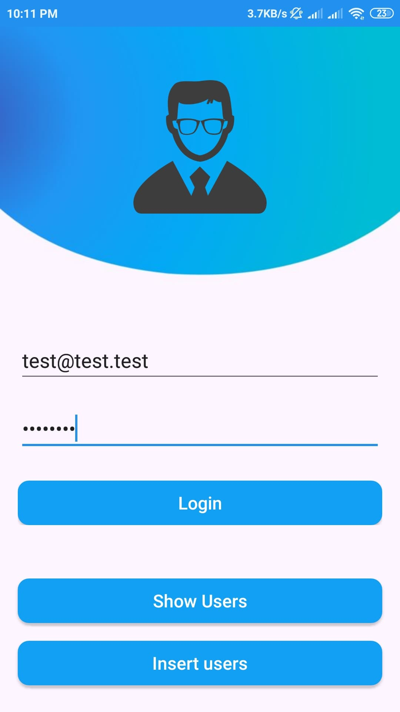
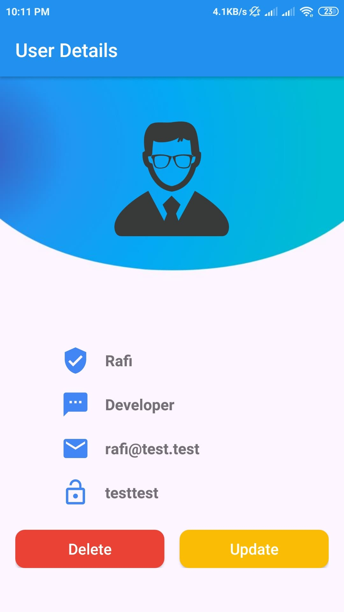
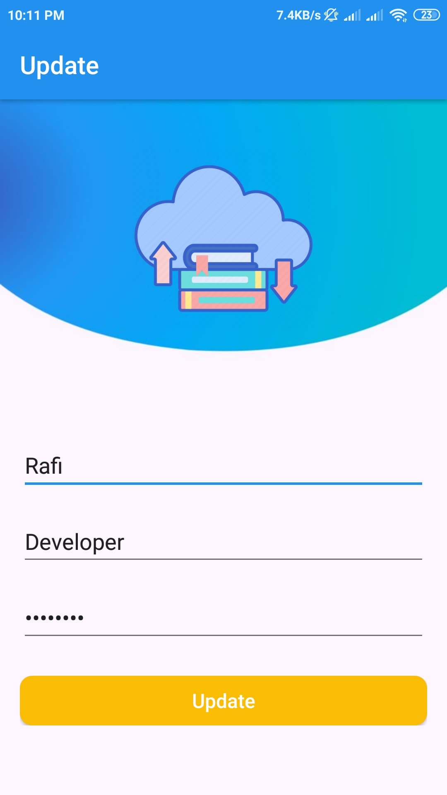
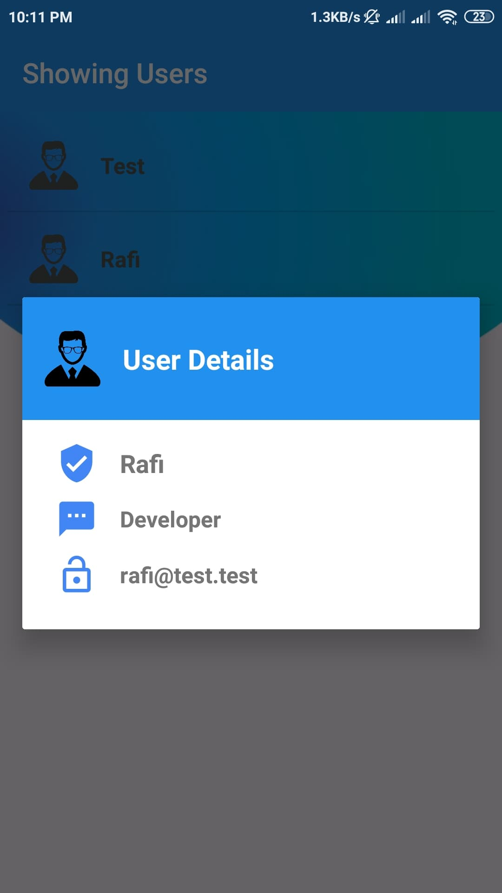
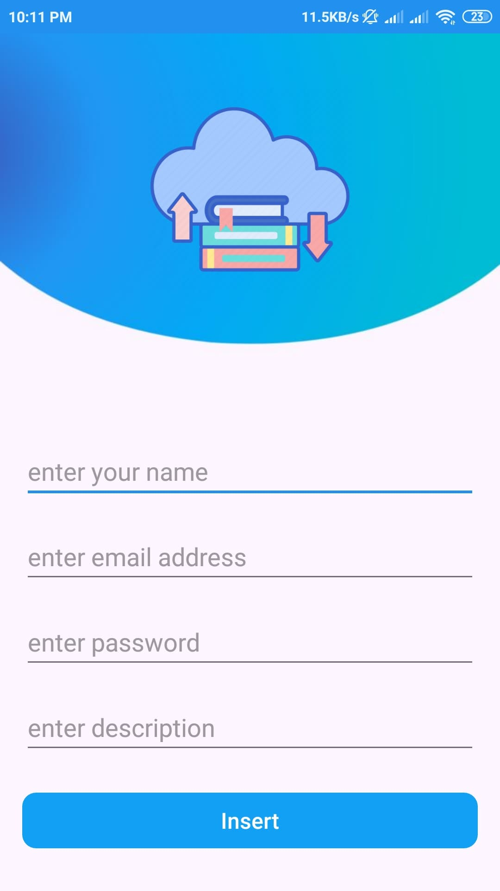

# volly

This project is for learning how to use volly library in android app.

### Features:
  - Insert
  - Read
  - Update
  - Delete
  
### Library

```java
dependencies:
  implementation 'com.android.volley:volley:1.1.1'
```

### User

```java
RequestQueue requestQueue = Volley.newRequestQueue(Insert.this);
            StringRequest stringRequest = new StringRequest(Request.Method.POST, Api,
                    new Response.Listener<String>() {
                        @Override
                        public void onResponse(String response) {
                            try {
                            
                            } catch (JSONException e) {
                                e.printStackTrace();
                            }

                        }
                    }, new Response.ErrorListener() {
                @Override
                public void onErrorResponse(VolleyError error) {
                
                }
            }) {
                @Override
                protected Map<String, String> getParams() throws AuthFailureError {
                    Map<String, String> params = new HashMap<>();

                    return params;
                }
            };
            requestQueue.add(stringRequest);
```

### Screenshots
 &nbsp;&nbsp;&nbsp;&nbsp;&nbsp;&nbsp;&nbsp;&nbsp;&nbsp;&nbsp;&nbsp;&nbsp;&nbsp;&nbsp;&nbsp;&nbsp; 
 &nbsp;&nbsp;&nbsp;&nbsp;&nbsp;&nbsp;&nbsp;&nbsp; 
